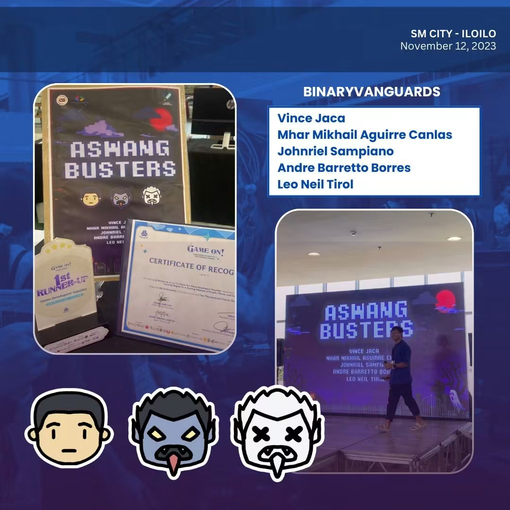

# Projects

  <button class="tab-btn active" onclick="showTab('softdev_tab')">Software Development</button>
  <button class="tab-btn" onclick="showTab('data_tab')">Database Administration / Data Engineering</button>
  <button class="tab-btn" onclick="showTab('others_tab')">Others</button>

    <h3>Aswang Busters</h3>
    
Awang Busters was a small game project created to participate in Hackathon "Game-On: Game Developer's Gauntlet". It is also my first introduction into Python.
    The premise of the game is simply to shoot as many Aswangs (A Filipino Ghost) in the given time, instead of a normal mouse and keyboard. The game uses a Nintendo Switch's Joycon for controls, leveraging and taking advantage of its built-in gyroscope module for aiming.
    

    <h4>Built With:</h4>
    <ul>
        <li>Python</li>
        <li>Tkinter for GUI</li>
        <li>joycon-python Library for Nintendo Switch Joy-Con Driver</li>
    </ul>
    <h4>screenshot(s)</h4>
    
    

  <ul>
    <li>Project C — short description</li>
    <li>Project D — short description</li>
  </ul>

  <ul>
    <li>Project E — short description</li>
    <li>Project F — short description</li>
  </ul>

